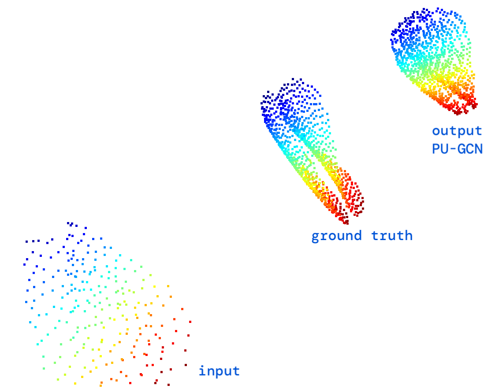

# PC-upsampling
PU-GCN（PyTorch ver.）による3次元点群アップサンプリング <br>
 

今全部 ```.iypnb``` のフォーマットであげました。あとで普通のPythonファイルに変換してアップロードしませ。素晴らしいLinux:penguin::white_heart:使う人はターミナル開いて、```ipython```のコマンドでIPythonのシェルを実行することで起動できる。そこから```.iypnb```のファイルを```run```コマンドで走らせる。Windowsもそうかも。知らん。Neovimしか使わないからVScodeとか、Pycharmも、知らん。無理だったら、GoogleColabかJupyter Notebookとかを使いましょう<br>

今だとHard coded variableが多い余裕があったろのしておく。とりあえずコメントでパスが書いてあるとこエラー出やすいところ指示しておいた。
## PU1K データセット　<br>
```Training.py```に使ったフォルダ　<br>
重すぎてアップロードするのにGitLFS使わないといけなくてめんどくさいです。）
zipファイルの中身、リポジトリの”```data```”フォルダにそのままextractしたら十分
[https://drive.google.com/file/d/1oTAx34YNbL6GDwHYL2qqvjmYtTVWcELg/view]


# 必要なPackage
```bash
pip install torch-cluster 
pip install torch-cluster 
pip install torch-sparse 
pip install git+https://github.com/pyg-team/pytorch_geometric.git

pip install omegaconf einops open3d class_resolver
pip install hausdorff 
```

```bash
pandas
numpy
open3d
scikit-learn
omegaconf
tqdm
hausdorff
networkx
h5py
```
## いけた環境のConfiguration(2023年れな版）
Ubuntu22.04 <br>
Pytorch2.1.1+cu121　（cuda12.1ってことね）<br>
python3.10 <br>
PCハードウェア: <br>
RTX 4090 -  16GB GDDR6 <br>
32GB RAM <br>

### PU1K Pre-trained models
学習データの問題で点数ー4倍しかできない <br>
今度8倍、16倍、32倍に設定するための .h5 ファイル作る予定。自分の .csvか.xyzデータを.h5にするのスクリプトもアップロードする。<br>
今自分が学習させた("pre-trained") モデル二つあげてる。<br>
一つ目　→ ```pu-gcn-16```　ベースラインモデル　<br>
二つ目 → ```pu-gcn-20``` dilatation を 20　にした（説明するのむず。自分で頑張って機械学習勉強してください。） 自分のPCでもいけましたが夜間に学習させたのでどんぐらいかかるかわからない。
A100 のcloudGPUを使って、10epochが６時間ぐらいかかちゃったので流石に、めっちゃハイスペック以外な個人PCでやるのは無理です。岩田先生にcloud GPUのお金出してもらうしか無いです。<br>


# Google Colabでやるなら　(意外と悪くない)
とりあえず、リポをzipとしてダウンロードして、ファイルを一旦extractして、自分のgoogle driveにアップロードしてください。<br>
使いたいファイルDriveからColabに開いて、そちて、上のところ、コードbox追加して、これをコピペしてください：

```bash
from google.colab import drive
drive.mount('/content/drive/')
cd drive/MyDrive/PC-upsampling #repositoryのpath 適当に変更して
```
```Evaluation.ipynb```に書いてあるパスとかちゃんとあってるか確認後、左上のRuntime>Run allクリックして終わり。　<br>

直接gitからcolabへcloneもできるけど更新・変更等は保存できなくなり、めちゃくちゃめんどくさい。

## Evaluation.ipynb → "ran out of input" エラー
Checkpoint (```./trained_model/```)のファイルが悪い時に出てくるエラ-　＜br>
ckptフォルダーがzipファイルになってないか確認して。

# シェレでやるなら　<br>
## Training <br>
モデルを0から学習させる場合　<br>
Ipythonシェル内
```run Training.iypnb```　<br>

## Test/Evaluation <br>
まずは```data```フォルダー内```results```フォルダー作成. 私みたい、ずっとbash使ってる人には：
```bash
cd data
mkdir results
cd ..
```
Ipythonシェル内
```run Evaluate.iypnb```　<br>
### CPUのみ場合
コメントにも書いてありますがGPU/cuda無い・使えない・使いたくない場合：
```In [17]``` のところ、
```python
checkpoint = torch.load(os.path.join("trained-models", ckpt_dir, ckpt_name)) #gpu version
```
ではなくて
```python
checkpoint = torch.load(os.path.join("trained-models", ckpt_dir, ckpt_name), map_location=torch.device('cpu')) #cpu version
```
にしないとエラーが出る
